Prompt: "Generate a mermaid diagram for rtt monitor"

mongo-spec-gpt:

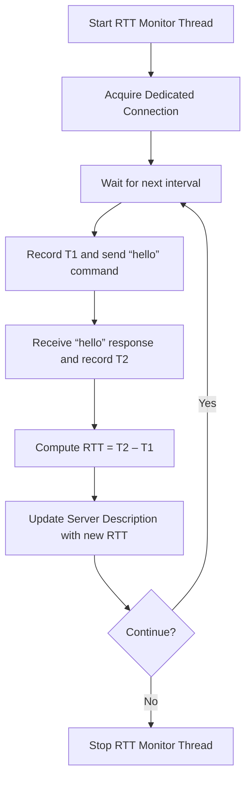

MongoGPT:

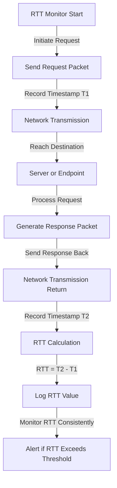
Prompt: "Generate a mermaid diagram for multi-threaded server selection"

### mongo-spec-gpt

Here’s a Mermaid flowchart illustrating a multi‐threaded (or asynchronous) server-selection loop. It uses a single global lock and a condition variable for waiting threads:

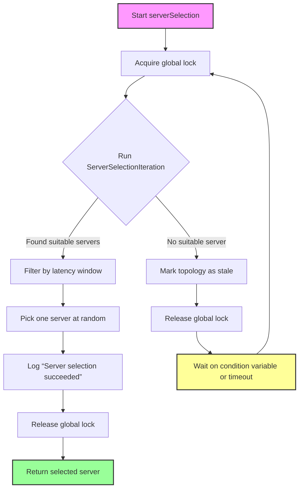

Explanation of the steps:

 1. **Acquire global lock**: Ensure only one thread at a time performs the iteration.
 2. **ServerSelectionIteration()**: Check the current topology and your read/write preferences.
 3. **If servers found**
    • Filter them by the configured latency window.
    • Pick one at random, log success, release the lock, and return it.
 4. **If none found**
    • Mark the local topology description as stale.
    • Release the lock and wait on a condition variable (or timeout) until another thread or background monitor updates the topology.
    • Once woken, re-acquire the lock and retry the loop.
  
Prompt: "Generate a mermaid sequence diagram for multi-threaded server selection"

### mongo-spec-gpt
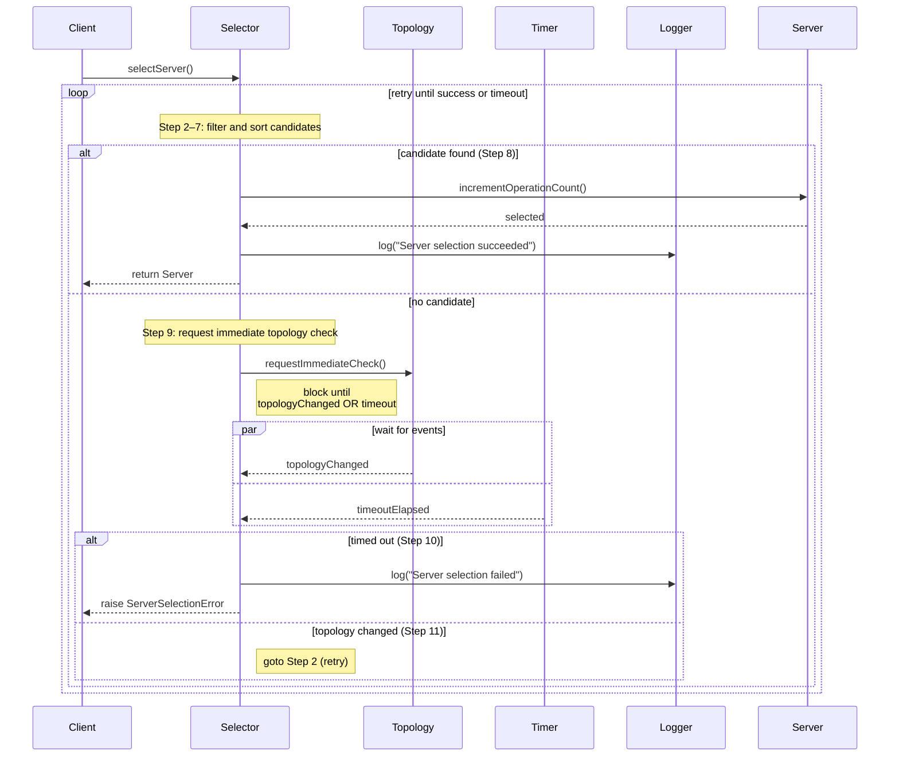

Notes:

- The outer `loop` represents retrying selection until either a server is found or the operation times out.
- The first branch (`alt candidate found`) corresponds to Step 8: incrementing the server’s `operationCount`, logging success, and returning the server.
- The second branch (`else no candidate`) corresponds to Steps 9–11:
  - Requesting an immediate topology check.
  - Blocking (waiting in parallel) for either a topology change or the timeout.
  - On timeout, logging failure and raising an error (Step 10).
  - On topology change, retrying the selection (Step 11).


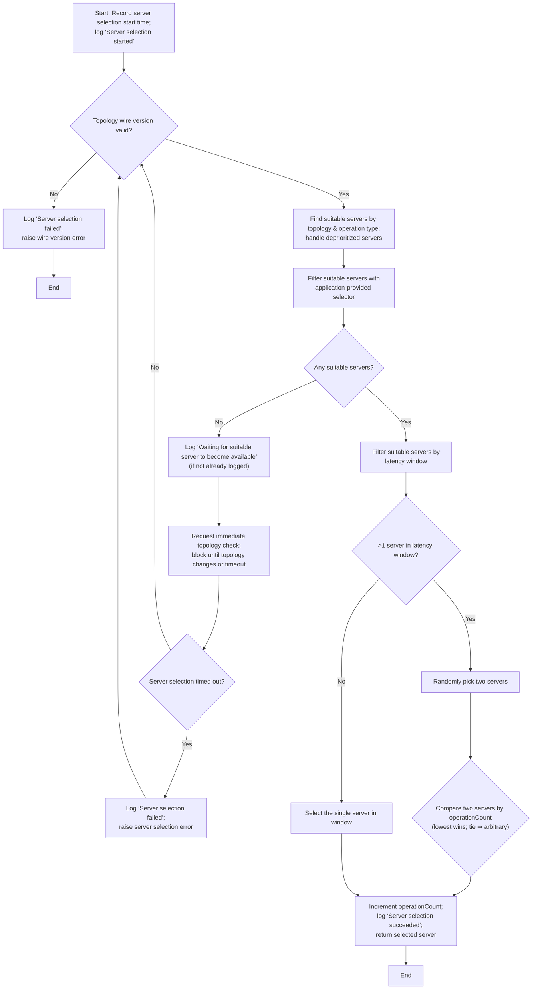

Generate a mermaid diagram for server selection with the following context: 

MongoDB’s drivers use a standardized “server selection” algorithm whenever they need to pick a server for an operation (read or write).  In broad strokes the process is:

1. Maintain a Topology Description
   • Each driver continually heartbeats every known host in the seed list or discovered via replica‐set gossip or sharding metadata.
   • From those heartbeats it builds and keeps up-to-date a view of the topology: which servers are primaries, secondaries, routers, unknown, etc., and their round‐trip latencies.

2. Determine the Operation’s Requirements
   • Writes always require the primary.
   • Reads use the configured Read Preference (primary, primaryPreferred, secondary, secondaryPreferred, nearest).
   • The Read Preference may include tag sets (e.g. `{ dc: "east", rack: "1" }`) to constrain eligible servers.

3. Filter by Server Type
   • From the current topology view, throw away any servers whose type cannot satisfy the request (e.g. drop secondaries for a primary‐only read).

4. Filter by Tags (if any)
   • If the Read Preference has tag sets, eliminate any servers that don’t match at least one set.

5. Apply Latency Window (“nearest” / localThresholdMillis)
   • Of the remaining candidates, find the minimum observed heartbeat RTT.
   • Discard any server whose RTT is more than localThresholdMillis (default 15 ms) above that minimum.
   • This ensures the driver only picks “nearby” nodes, preventing it from sending reads to a very slow replica even if it technically matches tags and type.

6. Select One at Random
   • From the final filtered list, pick a server at random (uniformly).
   • Use that connection for the operation.

7. Timeout and Retry
   • If the list ever becomes empty, the driver will retry heartbeats and re-run selection until the serverSelectionTimeout (default 30 s) expires, at which point it raises a server selection timeout error.

By separating discovery (heartbeat monitoring) from selection (filter → latency window → random choice), MongoDB drivers can react quickly to topology changes while still consistently steering operations to healthy, low-latency servers that meet your read/write and tagging requirements.

Result:
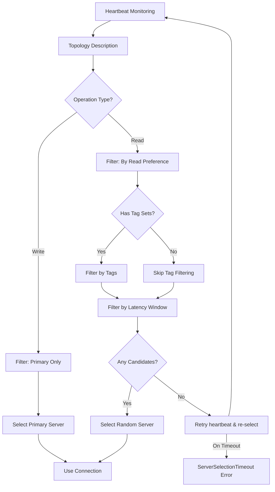

Explanation of the steps:

1. **Heartbeat Monitoring → Topology Description**
   Drivers continually heartbeat all known nodes and build a current view of the topology.

2. **Operation Type?**
   Branch to either a write or read selection path.

3. **Write Path**
   Always filter to the primary, then select and use it immediately.

4. **Read Path**
   a. Apply the configured read preference (primary, secondary, nearest, etc.).
   b. If there are tag sets, filter servers to those matching any tag set.
   c. Apply the latency window (localThresholdMillis) to drop high‐latency nodes.
   d. If candidates remain, pick one at random and use it.

5. **Retry / Timeout**
   If at any point the candidate list is empty, retry the selection loop (respecting minHeartbeatFrequencyMS) until serverSelectionTimeoutMS is reached, then raise a timeout error.

### Prompt (With Chaining): "How does server selection work? | Generate a mermaid diagram for server selection. The content of your diagram should not contain any quotation marks or parentheses."
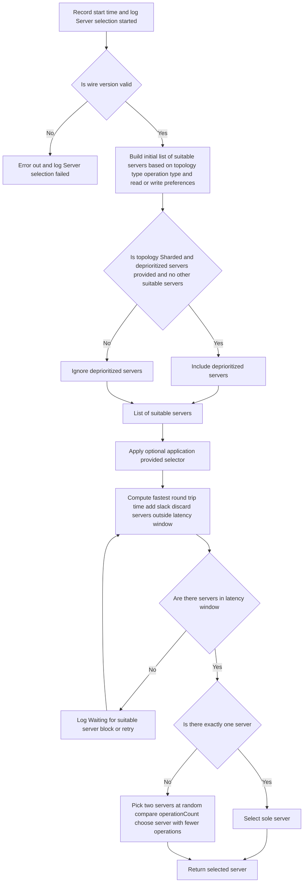

### Prompt (With Chaining): "How does rtt monitor  work? | Generate a mermaid diagram for rtt monitor. The content of your diagram should not contain any quotation marks or parentheses."
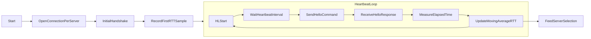
----
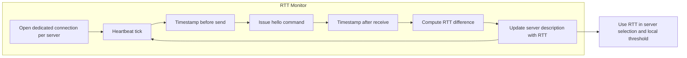
----
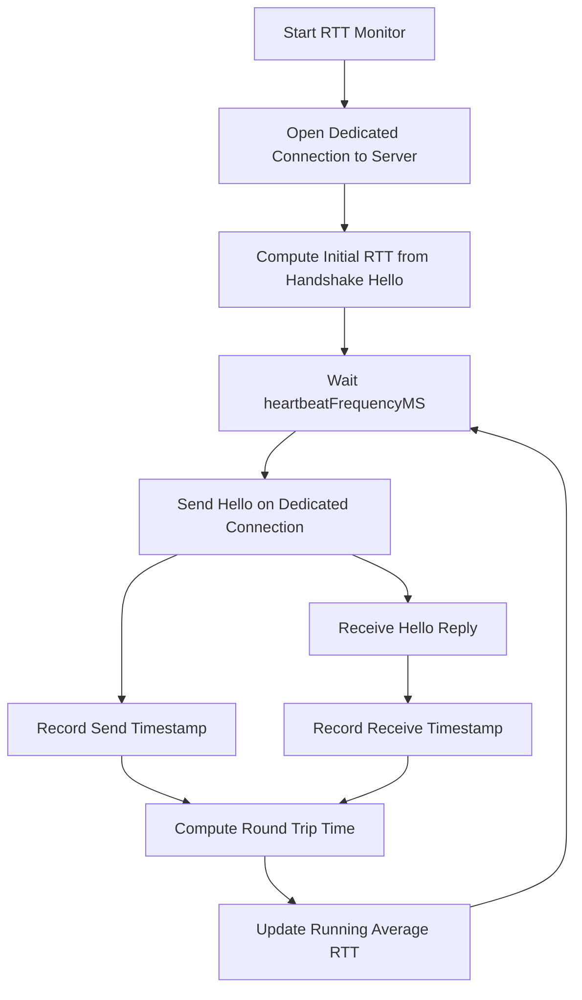
----
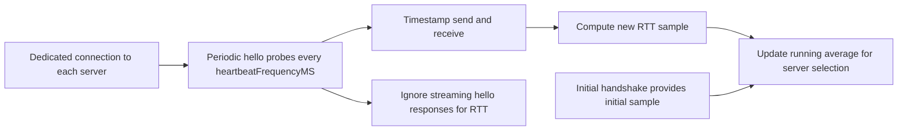
----
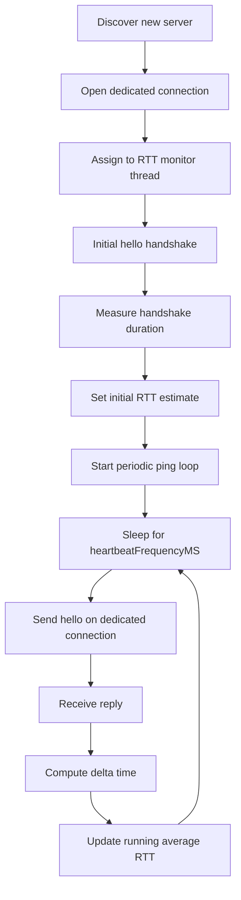
----
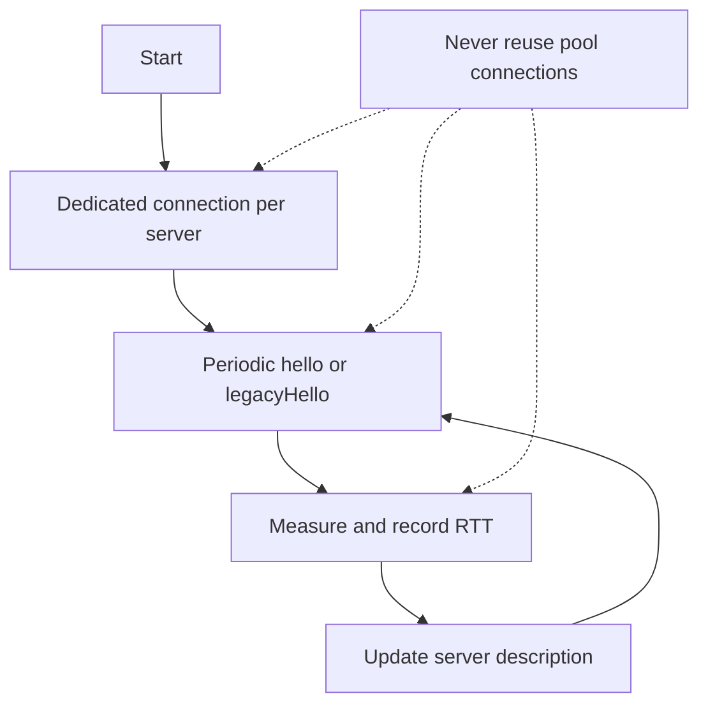
----
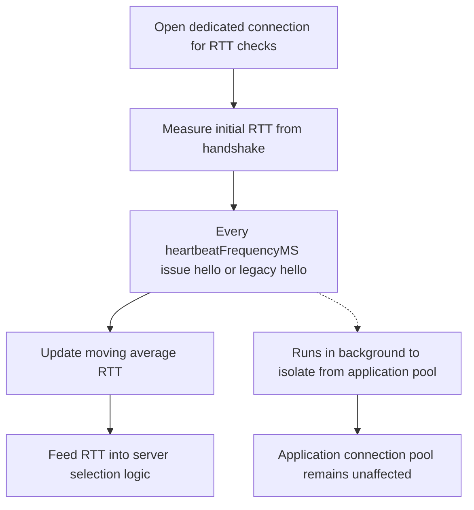
----
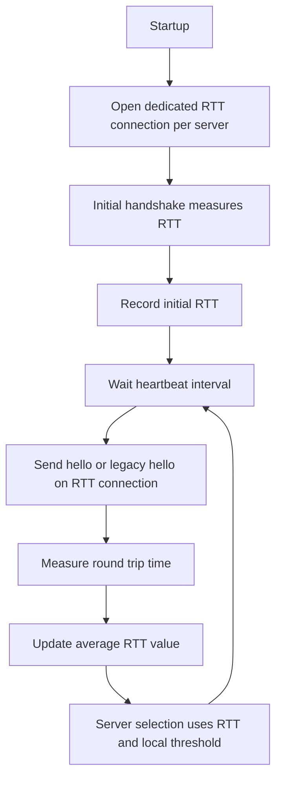
----
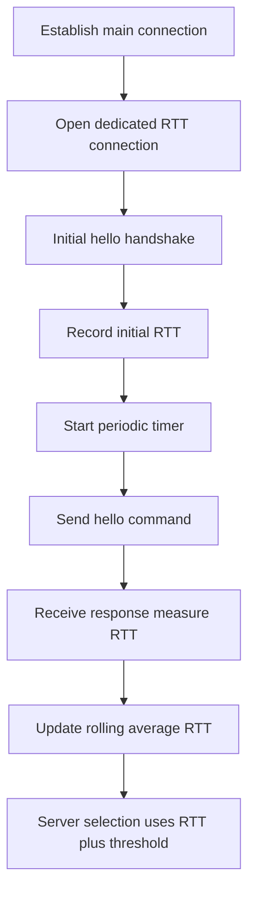

### Prompt (With Chaining): "How is SDAM supposed to function? | Generate a mermaid diagram for SDAM. The content of your diagram should not contain any quotation marks or parentheses."
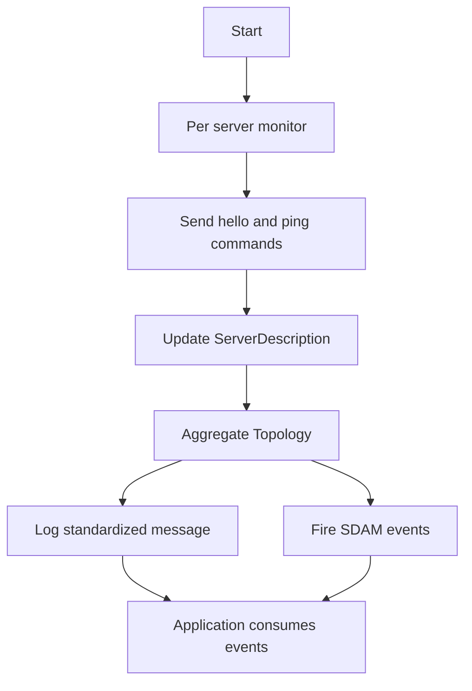
----

### Prompt (With Chaining): "How is rtt monitoring implemented? | Generate a mermaid diagram for rtt monitoring. The content of your diagram should not contain any quotation marks or parentheses."
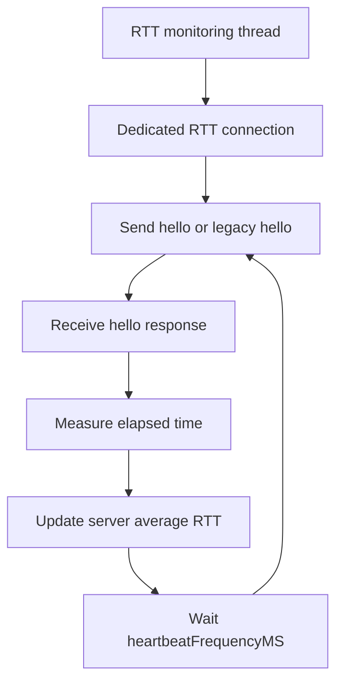
----
### Prompt (With Chaining): "How is rtt monitoring implemented? | How should I implement rtt monitoring in an algorithm? | Generate a mermaid diagram for rtt monitoring. The content of your diagram should not contain any quotation marks or parentheses."
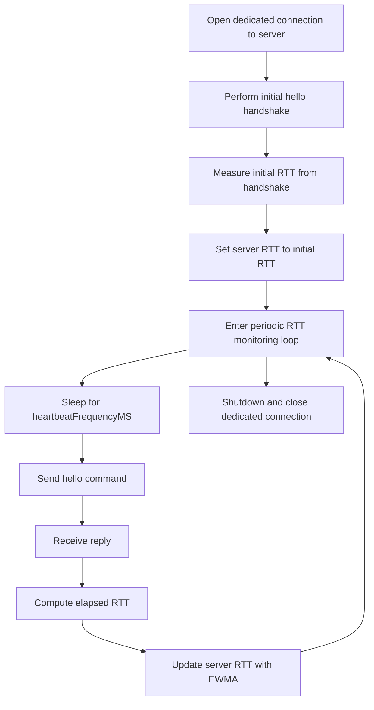
----
### Prompt (With Chaining): "How should I implement rtt monitoring in an algorithm? | Generate a mermaid diagram for rtt monitoring. The content of your diagram should not contain any quotation marks or parentheses."
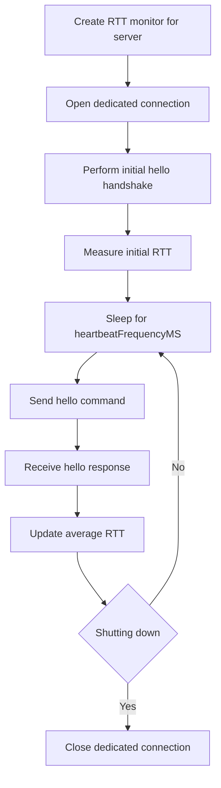
----
### Prompt (With Chaining): "How should I implement server selection in an algorithm? | Generate a mermaid diagram for server selection. The content of your diagram should not contain any quotation marks or parentheses."
 ```mermaid
graph TD
  A[Record start time and log Server selection started] --> B{Topology wire version valid}
  B -- no --> C[Log Server selection failed and error]
  B -- yes --> D[Build initial suitable servers list]
  D --> E[Apply application selector callback]
  E --> F{Suitable servers remaining}
  F -- yes --> G[Compute minimum ping and apply latency window]
  G --> H{Client is multithreaded or single threaded}
  H -- multithreaded --> I[If only one server select it else pick two random servers compare operation counts select lower and increment count]
  H -- single threaded --> J[Select random server]
  I --> K[Log Server selection succeeded and return server]
  J --> K
  F -- no --> L[Log waiting for suitable server message once]
  L --> M[Trigger immediate topology refresh and wait]
  M --> N{Timeout expired}
  N -- yes --> O[Log Server selection failed and raise timeout error]
  N -- no --> B
```
----
```mermaid
flowchart TD
  A[Start server selection] --> B{Topology wire version valid}
  B -- no --> C[Log server selection failed and throw error]
  B -- yes --> D[Build initial candidate set by topology type operation type tag sets max staleness]
  D --> E[Apply custom server selector callback]
  E --> F[Measure ping times compute minimum RTT filter by latency threshold]
  F --> G{Suitable candidates exist}
  G -- yes --> L{Multithreaded client model}
  G -- no --> H[Log waiting for suitable server]
  H --> I[Mark topology stale request immediate topology check]
  I --> J{Timeout elapsed}
  J -- yes --> K[Log server selection failed throw timeout error]
  J -- no --> B

  L -- yes --> M{Only one server in latency window}
  L -- no --> N[Select one server at random]
  M -- yes --> M1[Select single server increment operation count]
  M -- no --> M2[Select two servers compare operation count select lower increment operation count]

  M1 --> O[Log server selection succeeded return server]
  M2 --> O
  N --> O
```
----
### Prompt (With Chaining): "How should I implement server discovery in an algorithm? | Generate a mermaid diagram for server discovery. The content of your diagram should not contain any quotation marks or parentheses."
```mermaid
flowchart TD
  A[Start] --> B[Input seed list and global timeout]
  B --> C[Initialize knownServers to seed list]
  C --> D[Record startTime as now]
  D --> E{now minus startTime less than timeout}
  E -->|yes| F[For each address not yet probed send hello]
  F --> G[Wait with short timeout for replies]
  G --> H[For each successful reply parse fields and add new hosts]
  H --> I{New hosts discovered in this iteration}
  I -->|yes| E
  I -->|no| J[Exit loop]
  E -->|no| K[Initial topology ready]
  J --> K
  K --> L[End]
```
----
### Prompt (With Chaining): "How should I implement transactions  in an algorithm? | Generate a mermaid diagram for transactions. The content of your diagram should not contain any quotation marks or parentheses."
```mermaid
flowchart TB
    A[Start] --> B[Start Transaction]
    B --> C[Run Transaction Logic]
    C --> D{Error Occurred}
    D -->|Transient Transaction Error| E[Abort Transaction]
    E --> B
    D -->|Other Error| F[Abort Transaction]
    F --> G[End with Error]
    D -->|No Error| H[Commit Transaction]
    H --> I{Commit Error Occurred}
    I -->|Unknown Transaction Commit Result| H
    I -->|Other Commit Error| J[End with Error]
    I -->|No Error| K[Success End]
```
----
### Prompt (With Chaining): "How should I implement the server handshake in an algorithm? | Generate a mermaid diagram for server handshakes. The content of your diagram should not contain any quotation marks or parentheses."
```mermaid
flowchart TD
  A[Open Socket]
  B[Send Handshake with Operation Timeout]
  C{Handshake Error}
  D[Handle Handshake Failure]
  E[Parse Server Type]
  F{Versioned API and Legacy Hello Received}
  G{Server Type is Arbiter}
  H[Handshake Success]
  I[Perform Authentication Conversation]
  J{Authentication Error}
  K[Handle Authentication Failure]

  A --> B
  B --> C
  C -->|Yes| D
  C -->|No| E
  E --> F
  F -->|Yes| D
  F -->|No| G
  G -->|Yes| H
  G -->|No| I
  I --> J
  J -->|Yes| K
  J -->|No| H
```
----
### Prompt (With Chaining): "How should I implement CSOT in an algorithm? | Generate a mermaid diagram for CSOT. The content of your diagram should not contain any quotation marks or parentheses."
```mermaid
flowchart TD
  Start[Start operation] --> Init[Record start time and deadline]
  Init --> Op[Execute operation]
  Op --> Error{Did operation error}
  Error -- No --> Success[Return result]
  Error -- Yes --> Retryable{Is error retryable}
  Retryable -- No --> Fail[Raise error]
  Retryable -- Yes --> CSOTmode{Is CSOT enabled}
  CSOTmode -- Yes --> TimeLeft{Now before deadline}
  TimeLeft -- Yes --> Op
  TimeLeft -- No --> Fail
  CSOTmode -- No --> IsWrite{Is operation a write}
  IsWrite -- No --> Op
  IsWrite -- Yes --> RetryCount{Attempts less than two}
  RetryCount -- Yes --> Op
  RetryCount -- No --> Fail
```
----
### Prompt (With Chaining): "How should I implement CSOT timeouts in an algorithm? | Generate a mermaid diagram for CSOT timeouts. The content of your diagram should not contain any quotation marks or parentheses."
```mermaid
flowchart TD
    Start[Start Operation] --> Init[Record start time and user timeouts]
    Init --> ComputeRemaining[Compute elapsed and remaining total]
    ComputeRemaining --> CheckTotal{Remaining total greater than zero}
    CheckTotal -- No --> Timeout[Abort with CSOT timeout error]
    CheckTotal -- Yes --> PhaseCheck{In connect phase}
    PhaseCheck -- Yes --> ComputePhaseConnect[phase timeout equals smaller of remaining total and connect timeout]
    PhaseCheck -- No --> ComputePhaseOther[phase timeout equals remaining total]
    ComputePhaseConnect --> Attempt[Perform operation attempt with hard deadline now plus phase timeout]
    ComputePhaseOther --> Attempt
    Attempt --> ResultCheck{Success or non retryable error}
    ResultCheck -- Yes --> Return[Return operation result]
    ResultCheck -- No --> ComputeRemaining
```
----
### Prompt (With Chaining): "How should I implement primary election in an algorithm? | Generate a mermaid diagram for primary election. The content of your diagram should not contain any quotation marks or parentheses."
```mermaid
flowchart TD
  Start[Initialize state lastElectionId lastSetVersion lastProtocolVersion maxWireVersion]
  Start --> Discover[Discover new primary]
  Discover --> Extract[Extract electionId setVersion protocolVersion maxWireVersion]
  Extract --> CheckProto{lastProtocolVersion set and new protocolVersion not equal lastProtocolVersion}
  CheckProto -->|Yes| Reset[Accept new primary reset state values] --> End[End]
  CheckProto -->|No| CheckWire{maxWireVersion less than 17}
  CheckWire -->|Yes| MakeTuplesPre6[Form newTuple as newSetVersion newElectionId and oldTuple as lastSetVersion lastElectionId]
  CheckWire -->|No| MakeTuples6[Form newTuple as newElectionId newSetVersion and oldTuple as lastElectionId lastSetVersion]
  MakeTuplesPre6 --> Compare{newTuple less than oldTuple}
  MakeTuples6 --> Compare
  Compare -->|Yes| Stale[Mark member unknown keep old primary] --> End
  Compare -->|No| Accept[Accept new primary update state values] --> End
```
----
### Prompt (With Chaining): "How should I implement checking out a connection from a pool in an algorithm? | Generate a mermaid diagram for checking out a connection from a pool. The content of your diagram should not contain any quotation marks or parentheses."
```mermaid
flowchart TB
  Start --> SetupTimeoutTimer
  SetupTimeoutTimer --> CheckPoolState
  CheckPoolState -->|PoolClosed or PoolPaused| EmitError
  CheckPoolState -->|PoolActive| EnqueueCheckoutRequest
  EnqueueCheckoutRequest --> WaitQueueFront
  WaitQueueFront -->|NotAtFront| WaitQueueFront
  WaitQueueFront -->|AtFront| CheckAvailableConnections
  CheckAvailableConnections -->|AvailableCount greater zero| UseAvailableConnection
  CheckAvailableConnections -->|NoAvailable| CheckConnectionLimits
  CheckConnectionLimits -->|UnderMaxLimits| InitiateConnectionCreation
  CheckConnectionLimits -->|AtMaxLimits| AwaitCheckInOrCountChange
  InitiateConnectionCreation --> ConnectionCreationComplete
  ConnectionCreationComplete --> UseNewConnection
  UseAvailableConnection --> PrepareCheckedOutConnection
  UseNewConnection --> PrepareCheckedOutConnection
  AwaitCheckInOrCountChange --> WaitQueueFront
  PrepareCheckedOutConnection --> ReturnConnection
  EmitError --> End
  ReturnConnection --> End
```